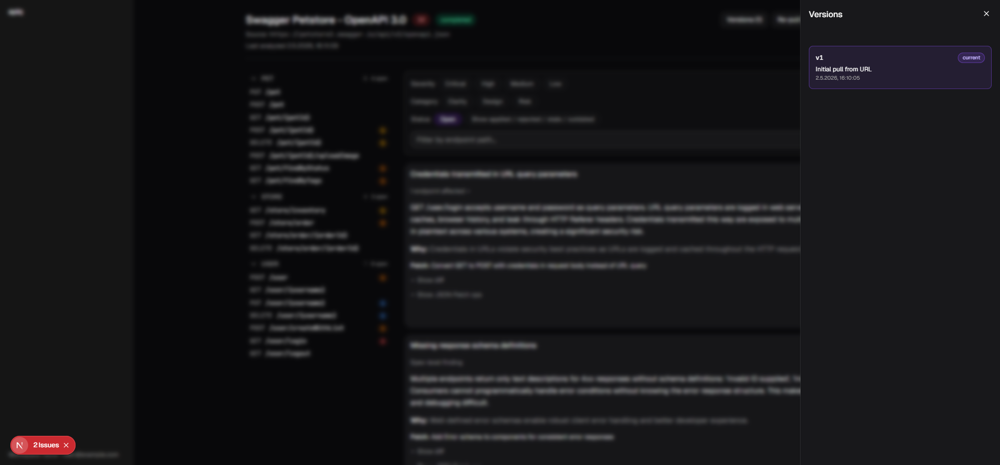

# APIQ

**API Intelligence platform.** LLM-mediated comprehension, scoring, and one-click improvement of OpenAPI specs.

Sibling project to [Expliq AI](https://github.com/Per-Paulsen/expliq-mvp): same stack, same spec-driven workflow philosophy, different domain (OpenAPI specs instead of n8n workflows).

## Live demo

🌐 **[apiq-mvp.vercel.app](https://apiq-mvp.vercel.app)** — pre-seeded portfolio demo. State resets daily at 03:00 UTC.

```
email:    demo@example.com
password: demo
```

The demo workspace ships with one analyzed spec (Swagger Petstore 3.0 — score 32, 14 findings) so you can immediately explore the apply-loop, version history, and export. Apply patches, undo, re-analyze — daily reset undoes everything for the next visitor.



## What it does

Drop in an OpenAPI spec (URL or paste). APIQ:

1. **Analyzes** the spec with an LLM, producing a quality score and a categorized list of findings — auth, errors, naming, schema, examples.
2. **Narrates each finding** in plain language: what's wrong, why it matters, what to change.
3. **Proposes one-click patches** for each finding. Apply, undo, or skip individually.
4. **Versions every change**, so you can roll back, diff, or export at any point.

Built end-to-end as a portfolio demonstration of AI-product engineering: PRD → epics → spec-driven implementation → tested deploy. **298 tests + lint + build clean.**

## Tech stack

Next.js 16 (App Router) · React 19 · TypeScript 5 · Tailwind v4 · shadcn/ui · Prisma 7 · Supabase (Postgres) · Auth.js v5 · OpenRouter (Claude Sonnet 4) · Vercel.

See [`tech-stack.md`](tech-stack.md) for pinned versions.

## Quick start (local development)

Prerequisites: Node 22+, a Postgres database (Supabase free-tier works), an OpenRouter API key, and a Cloudflare Turnstile site/secret pair.

```bash
git clone https://github.com/Per-Paulsen/apiq-mvp.git
cd apiq-mvp
npm install
cp .env.example .env
# fill the variables in .env (see .env.example for the full list)
npx prisma migrate deploy
npm run dev
```

Open [http://localhost:3000/signup](http://localhost:3000/signup) to create an account, then visit `/specs` and use "Add Spec" to pull an OpenAPI URL.

To populate a Petstore demo workspace locally:

```bash
npm run seed-demo
```

## Workflow

APIQ is built spec-driven via Claude Code skills (`/spec`, `/refine`, `/dev`, `/patch`). PRD → epic spec → implementation → tested deploy. See [`CLAUDE.md`](CLAUDE.md) for the full workflow + architecture conventions.

## Reference

| File | What it is |
|---|---|
| [`CLAUDE.md`](CLAUDE.md) | Architecture conventions and dev workflow |
| [`prd.md`](prd.md) | Original product vision |
| [`tech-stack.md`](tech-stack.md) | Pinned stack and versions |
| [`openapi-examples/`](openapi-examples/) | Sample OpenAPI specs for development |
| [`docs/screenshots/`](docs/screenshots/) | Per-epic UI screenshots from the build |
